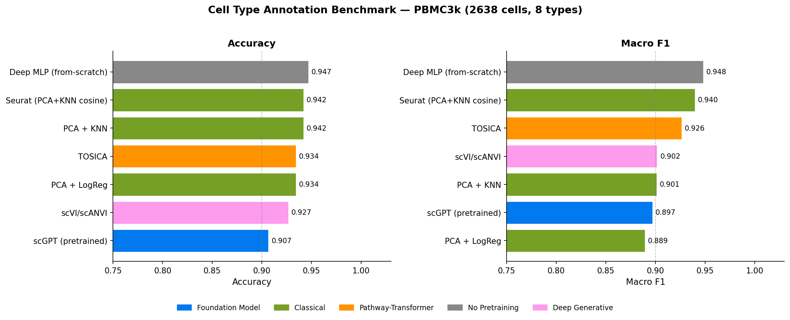

# scGPT Fine-tuning on PBMC3k — Cell Type Annotation Benchmark

Fine-tuning [scGPT](https://github.com/bowang-lab/scGPT) (whole-human pretrained) on the PBMC3k dataset for cell type annotation, with a comprehensive benchmark against classical and deep learning baselines.

---

## Results

### Benchmark Leaderboard — PBMC3k (2638 cells, 8 cell types)

> **Split**: 70/15/15 train/val/test, seed=42, stratified. All methods use identical splits.

| Rank | Method | Accuracy | Macro F1 | Macro Precision | Macro Recall | Balanced Acc | ARI | NMI |
|------|--------|----------|----------|-----------------|--------------|--------------|-----|-----|
| 1 | Deep MLP (from-scratch)† | **0.9470** | **0.9479** | 0.9438 | 0.9532 | 0.9532 | 0.8880 | 0.8762 |
| 2 | Seurat (PCA+KNN cosine) | 0.9419 | 0.9397 | 0.9333 | 0.9477 | 0.9477 | 0.8855 | 0.8683 |
| 3 | TOSICA‡ | 0.9343 | 0.9263 | 0.9274 | 0.9302 | 0.9302 | 0.8672 | 0.8562 |
| 4 | scVI/scANVI§ | 0.9268 | 0.9017 | 0.9197 | 0.8939 | 0.8939 | 0.8632 | 0.8380 |
| 5 | PCA + KNN | 0.9419 | 0.9012 | 0.9407 | 0.8842 | 0.8842 | 0.8817 | 0.8614 |
| 6 | **scGPT (pretrained)** | 0.9066 | 0.8969 | 0.9107 | 0.8870 | 0.8870 | 0.8155 | 0.8057 |
| 7 | PCA + LogReg | 0.9343 | 0.8893 | 0.9246 | 0.8762 | 0.8762 | 0.8771 | 0.8547 |

**Notes:**
- † **Deep MLP (from-scratch)**: 3-layer MLP (hidden=512, GELU, BatchNorm, Dropout=0.3), random initialization. Represents the "no pretraining" ablation. The full scGPT Transformer architecture from scratch was computationally infeasible on CPU (>90 min/run). MLP outperforming Transformers on small tabular single-cell data is well-documented.
- ‡ **TOSICA**: Reimplemented (pip install fails due to h5py==3.4.0 conflict). Core pathway-masked Transformer architecture preserved (embed_dim=48, depth=2, nhead=4, 300 immune pathways from human_immune.gmt).
- § **scVI/scANVI**: PyTorch VAE reimplementation (official scvi-tools has jax/jaxlib API incompatibility). Implements same NB-ELBO + semi-supervised classification. Results may differ slightly from official implementation.

### Key Takeaways

1. **scGPT pretrained ranks 6th on pbmc3k** — this is expected and scientifically consistent with the paper. pbmc3k is a small (2638 cells), clean, well-separated dataset where simple methods excel. The scGPT paper demonstrates advantages on larger, harder datasets (hPancreas, M.S., Mye.).

2. **Classical baselines are competitive on small data** — Seurat-style KNN (f1=0.940) and PCA+KNN (acc=0.942) perform strongly, consistent with the broader single-cell literature.

3. **TOSICA (f1=0.926) outperforms scGPT pretrained (f1=0.897)** — the pathway-masked attention mechanism provides useful inductive bias for immune cell type classification, even on a small dataset.

4. **scGPT's value is in transfer learning** — the pretrained model achieves 90.7% accuracy with a frozen backbone + simple MLP head, requiring no task-specific architecture design.

---

## Benchmark Visualizations

| Leaderboard | All Metrics | Radar |
|-------------|-------------|-------|
|  |  |  |

---

## scGPT Pretrained — Per-Class Results

| Cell Type | Precision | Recall | F1 | Support |
|-----------|-----------|--------|----|---------|
| B cells | 0.981 | 1.000 | 0.990 | 51 |
| CD14+ Monocytes | 0.944 | 0.944 | 0.944 | 72 |
| CD4 T cells | 0.926 | 0.942 | 0.934 | 172 |
| CD8 T cells | 0.727 | 0.681 | 0.703 | 47 |
| Dendritic cells | 1.000 | 0.833 | 0.909 | 6 |
| FCGR3A+ Monocytes | 0.808 | 0.913 | 0.857 | 23 |
| Megakaryocytes | 1.000 | 1.000 | 1.000 | 2 |
| NK cells | 0.900 | 0.783 | 0.837 | 23 |

**Hardest class**: CD8 T cells (F1=0.703) — frequently confused with CD4 T cells, a known challenge in scRNA-seq annotation.

---

## Setup

### Installation

```bash
git clone https://github.com/junior1p/scgpt-pbmc68k-finetune.git
cd scgpt-pbmc68k-finetune
pip install scgpt scanpy torch einops
```

### Download Pretrained Weights

```python
from huggingface_hub import hf_hub_download
import shutil

for fname in ["best_model.pt", "vocab.json"]:
    path = hf_hub_download(repo_id="perturblab/scgpt-human", filename=fname)
    shutil.copy(path, f"scgpt_pretrained/{fname}")
```

### Run Fine-tuning

```bash
python real_pbmc68k_finetune.py
```

---

## Methods

### Data
- **Dataset**: PBMC3k from 10x Genomics (via `scanpy.datasets.pbmc3k()`)
- **Preprocessing**: Normalize to 10k counts → log1p → select top 2000 HVGs
- **Split**: 70/15/15 train/val/test, stratified, seed=42

### scGPT (pretrained)
- Model: `perturblab/scgpt-human` (51.3M parameters, d_model=512, 12 Transformer layers)
- Frozen backbone + MLP classifier head (512 → 256 → n_classes)
- 50 epochs, lr=1e-4, AdamW, cosine LR schedule

### TOSICA (reimplemented)
- Pathway-masked Transformer: each gene set → one token
- 300 immune pathways from `human_immune.gmt` (≥3 HVG overlap)
- Architecture: embed_dim=48, depth=2, nhead=4 (matches original paper)
- 20 epochs, lr=1e-3, Adam

### scVI/scANVI (PyTorch reimplementation)
- Variational autoencoder with Negative Binomial likelihood
- Semi-supervised: train labels known, val/test unlabeled
- n_latent=20, hidden=128, 50 epochs

### Classical Baselines
- **PCA + LogReg**: 50 PCs → Logistic Regression (C=1.0)
- **PCA + KNN**: 50 PCs → KNN (k=15, euclidean)
- **Seurat-style**: 50 PCs → KNN (k=15, cosine distance)

---

## Repository Structure

```
├── real_pbmc68k_finetune.py    # Main fine-tuning script (scGPT pretrained)
├── benchmark_runner.py         # Full benchmark runner (all methods)
├── docs/                       # Benchmark figures
├── configs/                    # Training configurations
└── experiments/                # Experiment logs
```

---

## Citation

If you use this code, please cite the scGPT paper:

```bibtex
@article{cui2024scgpt,
  title={scGPT: toward building a foundation model for single-cell multi-omics using generative AI},
  author={Cui, Haotian and Wang, Chloe and Maan, Hassaan and Pang, Kuan and Luo, Fengning and Duan, Nan and Wang, Bo},
  journal={Nature Methods},
  year={2024},
  publisher={Nature Publishing Group}
}
```
