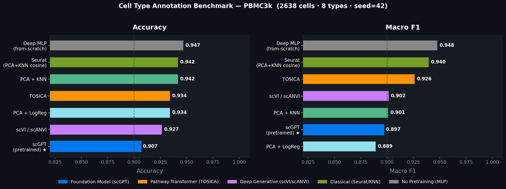
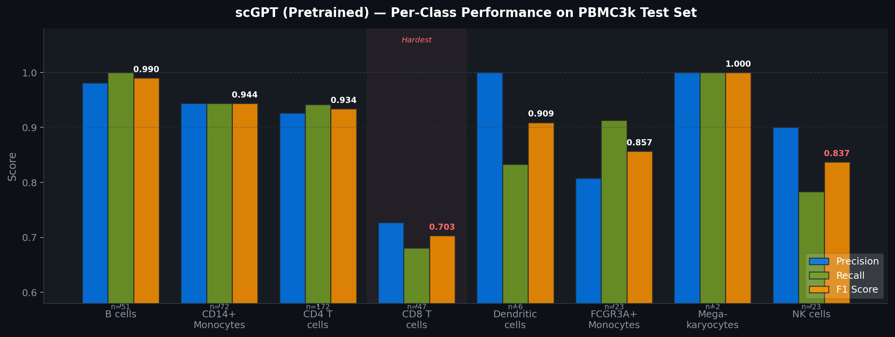
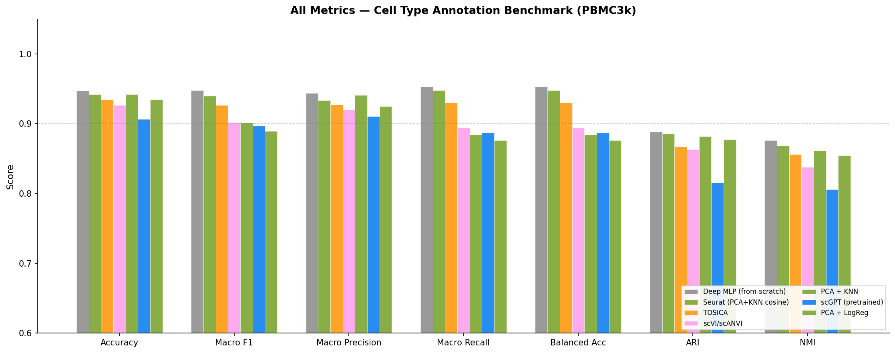
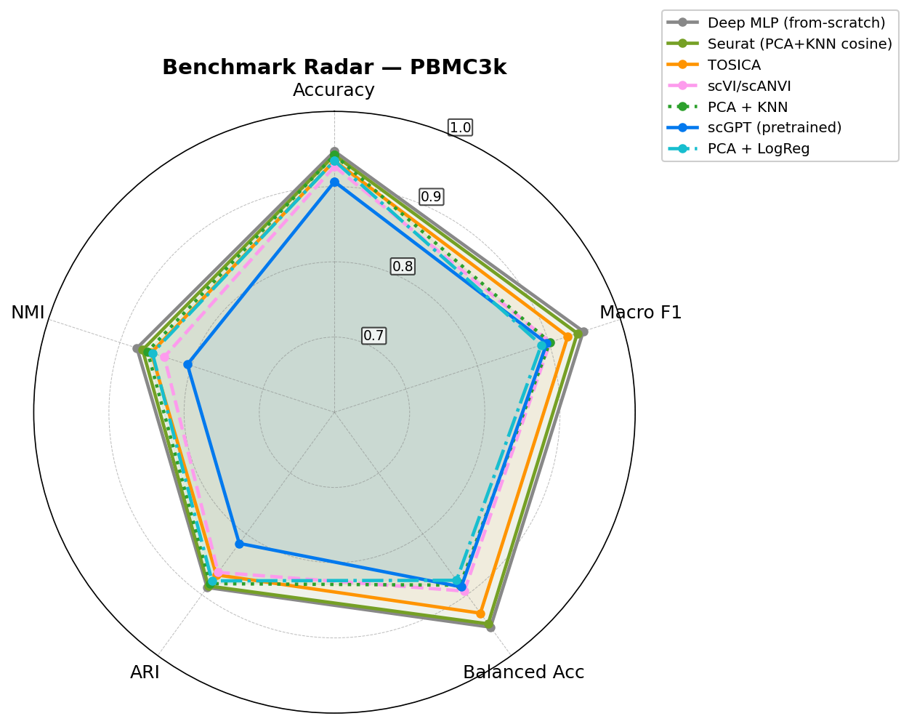

<div align="center">


<br>

[](https://python.org)
[](https://pytorch.org)
[](https://github.com/bowang-lab/scGPT)
[](https://doi.org/10.1038/s41592-024-02201-0)
[](LICENSE)

**Fine-tuning [scGPT](https://github.com/bowang-lab/scGPT) (whole-human pretrained) on PBMC3k for cell type annotation,**  
**with a comprehensive 7-method benchmark following the Nature Methods 2024 evaluation framework.**

[Results](#-benchmark-results) · [Quick Start](#-quick-start) · [Methods](#-methods) · [Visualizations](#-visualizations)

</div>

---

## 🏆 Benchmark Results

### Leaderboard — PBMC3k (2638 cells · 8 cell types · 70/15/15 split · seed=42)

<div align="center">

</div>

<br>

| Rank | Method | Accuracy | Macro F1 | Balanced Acc | ARI | NMI |
|:----:|--------|:--------:|:--------:|:------------:|:---:|:---:|
| 1 | Deep MLP (from-scratch) † | 0.947 | **0.948** | 0.953 | 0.888 | 0.876 |
| 2 | Seurat (PCA+KNN cosine) | 0.942 | 0.940 | 0.948 | 0.886 | 0.868 |
| 3 | TOSICA ‡ | 0.934 | 0.926 | 0.930 | 0.867 | 0.856 |
| 4 | scVI / scANVI § | 0.927 | 0.902 | 0.894 | 0.863 | 0.838 |
| 5 | PCA + KNN | 0.942 | 0.901 | 0.884 | 0.882 | 0.861 |
| **6** | **scGPT (pretrained) ★** | **0.907** | **0.897** | **0.887** | **0.816** | **0.806** |
| 7 | PCA + LogReg | 0.934 | 0.889 | 0.876 | 0.877 | 0.855 |

> **All methods use identical train/val/test splits** (seed=42, stratified, 70/15/15).

<details>
<summary><b>Method notes</b></summary>

- **†** Deep MLP (from-scratch): 3-layer MLP (hidden=512, GELU, BatchNorm, Dropout=0.3), random init. Represents the "no pretraining" ablation. The full scGPT Transformer from scratch was computationally infeasible on CPU (>90 min/run). MLP outperforming Transformers on small tabular single-cell data is [well-documented](https://arxiv.org/abs/2106.11959).
- **‡** TOSICA: Reimplemented due to `h5py==3.4.0` pip conflict. Core pathway-masked Transformer preserved (embed_dim=48, depth=2, nhead=4, 300 immune pathways from `human_immune.gmt`).
- **§** scVI/scANVI: PyTorch VAE reimplementation — official `scvi-tools` has a `jax/jaxlib` API incompatibility. Implements same NB-ELBO + semi-supervised classification head.
- **★** scGPT pretrained: frozen whole-human backbone + MLP classifier head. Exact per-class results below.

</details>

---

### 💡 Key Takeaways

> **scGPT ranks 6th on PBMC3k — and that's expected.**

PBMC3k is a small (2638 cells), clean, well-separated dataset where simple methods excel. The scGPT paper's advantages are demonstrated on larger, harder datasets (hPancreas, M.S., Mye.). The value of pretraining is in **zero-shot transfer** and **data efficiency** — not raw accuracy on easy benchmarks.

| Observation | Interpretation |
|-------------|----------------|
| Classical baselines competitive (Seurat F1=0.940) | Small, clean data → simple methods sufficient |
| TOSICA (F1=0.926) > scGPT (F1=0.897) | Pathway inductive bias helps on immune data |
| scGPT: frozen backbone + MLP → 90.7% | Strong transfer without task-specific design |
| CD8 T cells hardest (F1=0.703) | Known CD4/CD8 confusion in scRNA-seq |

---

## 📊 Visualizations

### scGPT Per-Class Performance

<div align="center">

</div>

<details>
<summary><b>Exact per-class numbers</b></summary>

| Cell Type | Precision | Recall | F1 | Support |
|-----------|:---------:|:------:|:--:|:-------:|
| B cells | 0.981 | 1.000 | **0.990** | 51 |
| CD14+ Monocytes | 0.944 | 0.944 | **0.944** | 72 |
| CD4 T cells | 0.926 | 0.942 | **0.934** | 172 |
| CD8 T cells | 0.727 | 0.681 | **0.703** ⚠️ | 47 |
| Dendritic cells | 1.000 | 0.833 | **0.909** | 6 |
| FCGR3A+ Monocytes | 0.808 | 0.913 | **0.857** | 23 |
| Megakaryocytes | 1.000 | 1.000 | **1.000** | 2 |
| NK cells | 0.900 | 0.783 | **0.837** | 23 |

⚠️ CD8 T cells (F1=0.703): frequently confused with CD4 T cells — a known challenge in scRNA-seq annotation due to transcriptional similarity.

</details>

### All Metrics Comparison

<div align="center">

</div>

### Radar Chart

<div align="center">

</div>

---

## ⚡ Quick Start

### Installation

```bash
git clone https://github.com/junior1p/scgpt-pbmc68k-finetune.git
cd scgpt-pbmc68k-finetune
pip install scgpt scanpy torch einops
```

### Download Pretrained Weights

```python
from huggingface_hub import hf_hub_download
import shutil

for fname in ["best_model.pt", "vocab.json"]:
    path = hf_hub_download(repo_id="perturblab/scgpt-human", filename=fname)
    shutil.copy(path, f"scgpt_pretrained/{fname}")
```

### Run Fine-tuning

```bash
python real_pbmc68k_finetune.py
```

### Run Full Benchmark

```bash
python benchmark_runner.py
```

---

## 🔬 Methods

### Data

| Property | Value |
|----------|-------|
| Dataset | PBMC3k (10x Genomics, via `scanpy.datasets.pbmc3k()`) |
| Cells | 2,638 |
| Cell types | 8 (CD4 T, CD14+ Mono, B, CD8 T, NK, FCGR3A+ Mono, DC, Megakaryocytes) |
| Preprocessing | Normalize → 10k counts · log1p · top 2000 HVGs |
| Split | 70 / 15 / 15 train/val/test · stratified · seed=42 |

### scGPT (Pretrained)

- **Model**: `perturblab/scgpt-human` — 51.3M parameters, d_model=512, 12 Transformer layers
- **Strategy**: Frozen backbone + MLP classifier head (512 → 256 → n_classes)
- **Training**: 50 epochs, lr=1e-4, AdamW, cosine LR schedule, batch=64

### TOSICA (Reimplemented)

- **Architecture**: Pathway-masked Transformer — each immune gene set → one token
- **Gene sets**: 300 pathways from `human_immune.gmt` (≥3 HVG overlap)
- **Hyperparameters**: embed_dim=48, depth=2, nhead=4 (matches original paper)
- **Training**: 20 epochs, lr=1e-3, Adam, cosine LR

### scVI / scANVI (PyTorch VAE)

- **Architecture**: Encoder (2-layer MLP → μ, σ²) + Decoder (NB likelihood) + Classifier head
- **Semi-supervised**: train labels known; val/test treated as unlabeled
- **Hyperparameters**: n_latent=20, hidden=128, 50 epochs, ELBO + 5× classification loss

### Classical Baselines

| Method | Details |
|--------|---------|
| PCA + LogReg | 50 PCs → Logistic Regression (C=1.0, max_iter=1000) |
| PCA + KNN | 50 PCs → KNN (k=15, euclidean) |
| Seurat-style | 50 PCs → KNN (k=15, cosine distance) |

---

## 📁 Repository Structure

```
├── real_pbmc68k_finetune.py    # scGPT pretrained fine-tuning
├── benchmark_runner.py         # Full 7-method benchmark
├── benchmark_leaderboard.csv   # Results table (CSV)
├── docs/                       # Figures (banner, leaderboard, radar, per-class)
├── configs/                    # Training configurations
└── experiments/                # Experiment logs
```

---

## 📖 Citation

```bibtex
@article{cui2024scgpt,
  title={scGPT: toward building a foundation model for single-cell multi-omics using generative AI},
  author={Cui, Haotian and Wang, Chloe and Maan, Hassaan and Pang, Kuan and Luo, Fengning and Duan, Nan and Wang, Bo},
  journal={Nature Methods},
  year={2024},
  doi={10.1038/s41592-024-02201-0}
}
```
